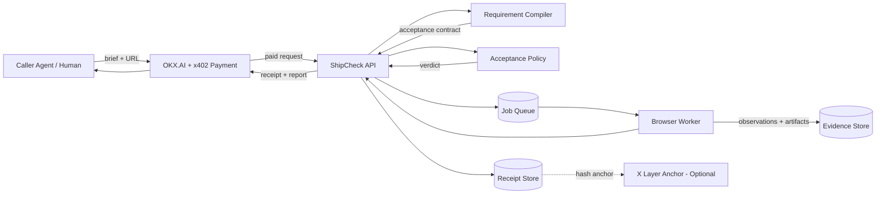
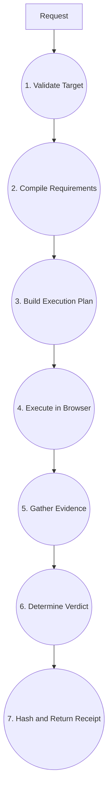

# Architecture and Data Flow

## Context diagram



## Level 0 DFD



## Trust boundaries

### Public API

All fields are untrusted. The target URL is an SSRF vector.

### LLM compiler

Compiler output is untrusted until schema-validated and normalized. It cannot issue arbitrary code or browser instructions.

### Browser worker

The destination is hostile. It can redirect, fingerprint, attempt downloads, open popups, consume resources, and target internal networks.

### Evidence store

Evidence may contain target-site data. Access must be scoped and time-limited.

### Payment

Payment verification is delegated to the official OKX x402 integration. Business logic must not run before paid-route middleware succeeds.

## Components

### API gateway

- validation;
- payment middleware;
- idempotency;
- request status;
- response serialization;
- rate limits.

### Requirement compiler

- semantic extraction;
- atomic decomposition;
- classification;
- source-span preservation;
- clarification;
- no verdicting.

### Contract validator

- JSON Schema validation;
- bounds;
- adapter validation;
- duplicate merging;
- unsafe instruction rejection.

### Execution planner

Maps requirement intent into a finite DSL. It never emits arbitrary JavaScript.

### Browser worker

Executes the DSL with Playwright in an isolated container.

### Evidence normalizer

Converts raw browser output into canonical observations.

### Acceptance policy

Pure function:

```typescript
determineVerdict(contract, requirementResults, policy): AcceptanceVerdict
```

### Receipt builder

Canonicalizes and hashes:

- contract;
- target fingerprint;
- results;
- evidence manifest;
- policy identifiers.

## Deployment topology

```text
Edge/API service
    ↓
Redis-compatible queue
    ↓
Containerized browser workers
    ↓
Object storage for evidence
    ↓
Postgres for contracts, jobs, and receipts
```

Avoid running Chromium inside a constrained edge function. Keep the payment/API path separate from the isolated browser workload.
