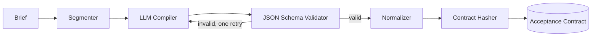
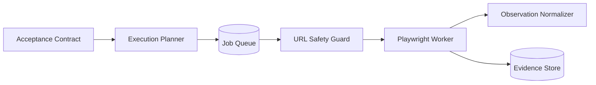
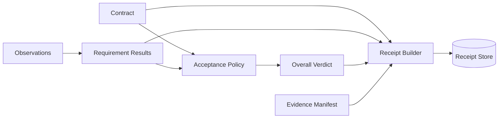
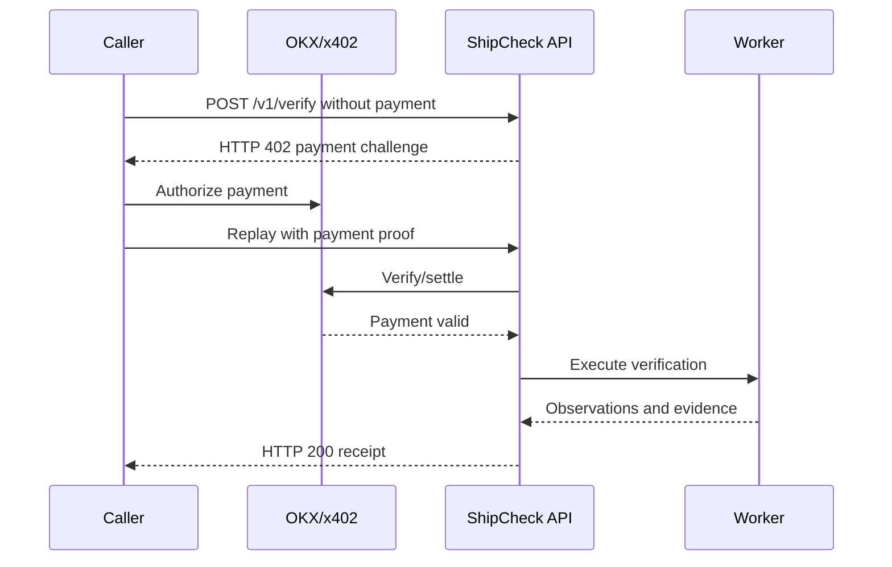

# Detailed Data Flow Diagrams

## Requirement compilation

```mermaid
flowchart LR
    B[Brief]
    S[Segmenter]
    M[LLM Compiler]
    J[JSON Schema Validator]
    N[Normalizer]
    K[Contract Hasher]
    C[(Acceptance Contract)]

    B --> S --> M --> J
    J -->|invalid, one retry| M
    J -->|valid| N --> K --> C
```

## Browser execution

```mermaid
flowchart LR
    C[Acceptance Contract]
    P[Execution Planner]
    Q[(Job Queue)]
    U[URL Safety Guard]
    W[Playwright Worker]
    O[Observation Normalizer]
    E[(Evidence Store)]

    C --> P --> Q --> U --> W
    W --> O
    W --> E
```

## Verdict and receipt

```mermaid
flowchart LR
    C[Contract]
    O[Observations]
    A[Acceptance Policy]
    R[Requirement Results]
    V[Overall Verdict]
    M[Evidence Manifest]
    H[Receipt Builder]
    S[(Receipt Store)]

    C --> A
    O --> R --> A
    A --> V
    C --> H
    R --> H
    V --> H
    M --> H
    H --> S
```

## Payment

```mermaid
sequenceDiagram
    participant Caller
    participant OKX as OKX/x402
    participant API as ShipCheck API
    participant Worker

    Caller->>API: POST /v1/verify without payment
    API-->>Caller: HTTP 402 payment challenge
    Caller->>OKX: Authorize payment
    Caller->>API: Replay with payment proof
    API->>OKX: Verify/settle
    OKX-->>API: Payment valid
    API->>Worker: Execute verification
    Worker-->>API: Observations and evidence
    API-->>Caller: HTTP 200 receipt
```
